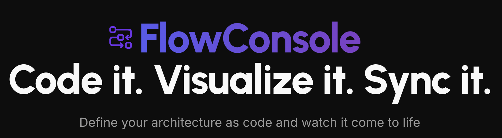
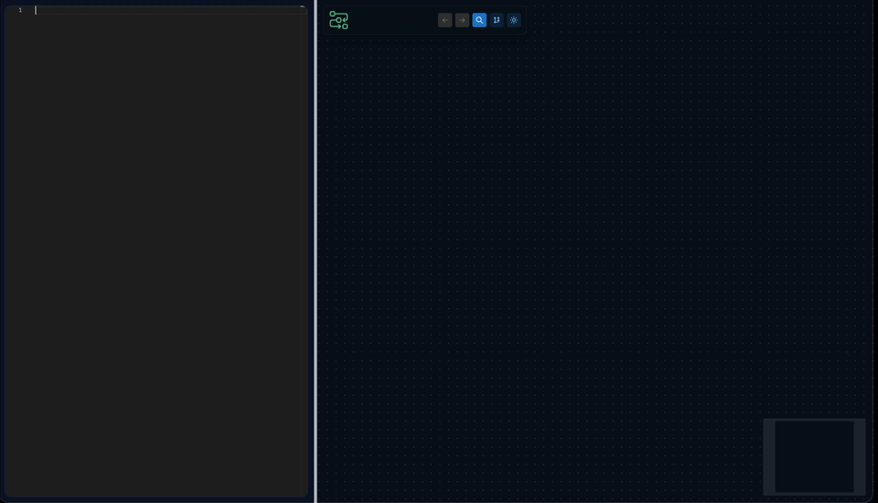

<p align="center">
  <a href="https://slackmaster9999.github.io/flowconsole/" target="_blank" rel="noopener noreferrer">
    
  </a>
</p>
<br/>
<p align="center">
  <a href="https://img.shields.io/github/v/release/slackmaster9999/flowconsole"></a>
  <a href="https://github.com/slackmaster9999/flowconsole/actions/workflows/ci.yml"></a>
  <a href="https://github.com/slackmaster9999/flowconsole/actions/workflows/playground.yml"></a>
  <a href="https://discord.gg/23CkhhDz"></a>
  <a href="https://github.com/slackmaster9999/flowconsole/blob/dev/LICENSE"></a>
</p>
<p align="center">
    <a href="https://slackmaster9999.github.io/flowconsole/?utm_source=gh-hero">Docs</a>
    ·
    <a href="https://dev.flowconsole.pages.dev/?utm_source=gh-hero">Playground</a>
    ·
    <a href="#roadmap">Roadmap</a>
</p>

> FlowConsole(alpha) is a new breed of architecture as code tooling that significantly improves developers experience with architecture artifacts. You can model your architecture in code with powerful fluent API.

# Demo ⚡


<br/>

> Features 
- ⚡️ Fully typed APIs
- 🥳 Auto positioning system
- 🛠️ Generates animated diagrams on the fly
- 👀 Generates animated system flows on the fly
- 🙌 C4 backed
- ▶️ Live Playground with examples

<p align="center"><span style="font-size:3.5em"><a href="https://dev.flowconsole.pages.dev/?utm_source=gh-try-it" target="_blank" rel="noopener noreferrer">Go to Playground</a> </span> </p>

```typescript

//who is using your app
const user: User = { name: "Customer", description: "app user" };

//add components(microservices, cache, db, etc)
const frontApp: ReactApp = {
  name: "Customer Dashboard",
  description: "React app"
};

const restApi: RestApi = {
  name: "Backend",
  description: "Java REST API"
};

const db: Postgres = {
  name: "main_db",
  description: "DB"
};

//Define a flow and watch it live
user.sendsRequestTo(frontApp, "opens in browser")
    .then(frontApp).sendsRequestTo(restApi, "GET /api/v1/dashboard/:id")
    .then(restApi).sendsRequestTo(db,"fetch dashboard data");
```


## Roadmap
- VS Code extension
- Jetbrains IDEA/Rider extension
- CLI tool for artifacts generation in your CI/CD pipeline
- C#(WIP), Java, Go, Python support(vote your language!)
- Publish engine architecture json scheme(so LLMs can help you)
- Drift CLI tool to check for architecture drifts


## Quick start scripts
0. Prereqs: Node.js 18+ and `pnpm` installed.
1. cd to src/docs or src/app
2. Install deps: `pnpm install`.
3. Run dev server: `pnpm dev`.
4. Build: `pnpm build`.

## Scripts (for docs and playgroud)
- `pnpm dev` — start Vite dev server.
- `pnpm build` — type-check and build for production.
- `pnpm lint` — run ESLint (`eslint.config.js`).
- `pnpm lint:fix` — ESLint with auto-fix.
- `pnpm test:unit` / `pnpm test:coverage` — Vitest suites.
- `pnpm test:e2e` — Playwright against a built app.

### Playground E2E tests (Playwright)
- Location: tests/e2e
- Default preview port is controlled by `PORT` (defaults to `4173`); `PLAYWRIGHT_BASE_URL` can override the target URL.
- Typical CI/local run: `pnpm build && PORT=4173 pnpm test:e2e`.
- Tests start `pnpm preview` automatically via `playwright.config.ts` and reuse an existing server when not on CI.
- `pnpm test:e2e` — to run tests.

## Architecture
- `src/core/components/Workbench/CodeDiagramWorkbench`: Monaco-based editor + model preview, debounced evaluation.
- `src/core/components/ArchitectureDiagram`: Reactflow renderer with autolayout navigation panel.
- `src/core/languages/typescript`: DSL declarations, evaluator, and samples that compile authored code into architecture models.
- `src/core/components/NavigationPanel`: flow and scope navigation for rendered models.

## Contributing
- Contributions are welcome!
- See `CONTRIBUTING.md` for setup, standards, and how to file issues/PRs.
- Community expectations: `CODE_OF_CONDUCT.md`.

## License
The core of FlowConsole is released as open-source software under the
**Apache License, Version 2.0**.

You are free to:
- use the software for any purpose,
- modify it,
- distribute it,
- use it in commercial and non-commercial projects,
- self-host it or embed it into your own systems,

as long as you comply with the terms of the Apache License 2.0.

See the [LICENSE](./LICENSE) file for details.  
See the [NOTICE](./NOTICE) file for required attributions.
---

## Commercial / Hosted Offering

In addition to the open-source core, the FlowConsole project may provide
commercial offerings, such as:
- managed SaaS deployments,
- enterprise features,
- proprietary plugins or extensions,
- commercial support and services.

These offerings are **not part of this open-source repository** and are
provided under separate commercial terms.

Use of the FlowConsole hosted service is governed by its own
Terms of Service and does not change the licensing of the open-source core.

---
## Trademarks

The FlowConsole name, logo, and branding are trademarks of the project
maintainers and may not be used without permission.

This does not affect your rights to use, modify, or distribute the
open-source software itself.
## Disclaimer

This software is provided "as is", without warranty of any kind, express
or implied. See the LICENSE file for details.